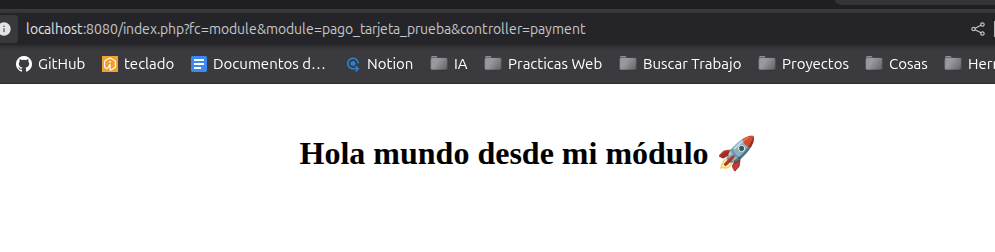
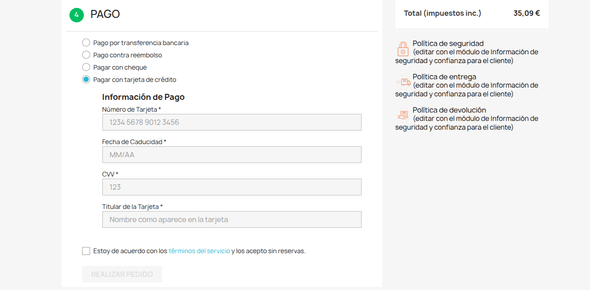

# Proceso de desarrollo de la prueba técnica:

Este documento describe el proceso desde la configuración de un entorno de desarrollo local para PrestaShop utilizando Docker,hasta la creación del un módulo personalizado.

## Enunciado:

**Prueba técnica: Módulo de pago con validación de tarjeta (compatible con PrestaShop 1.7 y 8)**
Desarrolla un módulo de pago para PrestaShop que cumpla con todos los requisitos funcionales y de arquitectura, de forma que sea compatible tanto con la versión 1.7 como con la 8.0 de PrestaShop.

El módulo debe simular un proceso de pago con tarjeta de crédito, sin conectarse a ninguna pasarela real, y debe quedar integrado en el sistema nativo de pagos de PrestaShop.

Requerimientos del módulo:

- **Integración nativa:** La nueva forma de pago debe aparecer correctamente en la lista de métodos de pago en el back-office de PrestaShop (Configurar > Preferencias > Pago). Un administrador debe poder activar o desactivar esta forma de pago como si fuera una forma de pago nativa.

- **Formulario embed:** En el checkout del front-office, el módulo debe mostrar un formulario de pago integrado en la misma página, sin redirigir al usuario. El formulario debe incluir los siguientes campos ficticios:

  - Número de tarjeta

  - Fecha de caducidad (MM/AA)

  - CVV

  - Titular de la tarjeta

- **Lógica de validación:** El módulo debe validar el pago basándose en el número de tarjeta. Para ello, utiliza los siguientes datos de tarjeta ficticios:

  - Para un pago aceptado: 1234 5678 9012 3456

  - Para un pago fallido: 9999 9999 9999 9999

- **Gestión del pedido:**

  - Si el número de tarjeta coincide con el de éxito, el módulo debe confirmar el pedido y cambiar su estado a 'Pago aceptado'.

  - Si el número de tarjeta coincide con el de error, el módulo debe cancelar el pedido y cambiar su estado a 'Pago fallido'.

  - Cualquier otro número de tarjeta debe ser tratado como un pago fallido.

- **Confirmación y errores:**

  - Después de la acción del usuario, el módulo debe redirigir a la página de confirmación de pedido.

  - Si el pago falla, el módulo debe mostrar un mensaje de error claro en el mismo formulario antes de redirigir.

## 1. Despliegue del Entorno con Docker e instalación PrestaShop

Para este proyecto, he utilizado Docker y Docker Compose para crear un entorno local que incluye un servidor web y una base de datos para poder instalar PrestaShop y trabajar con él.

**Pasos del despliegue:**

1.  **Descargar archivo de instalación .zip Prestashop**
    Desde la web https://prestashop.es/versions/, para esta prueba uso Prestashop 8.2.2.

2.  **Configurar el archivo Docker Compose:** Crear un archivo llamado `docker-compose.yml` en la raíz del proyecto. Este archivo define la configuración del entorno en el que trabajaré.

3.  **Ejecutar el despliegue:** En la carpeta donde se encuentra el archivo `docker-compose.yml`, se ejecuta el siguiente comando. Esto descargará las imágenes y creará los contenedores.
    ```
    docker-compose up -d
    ```
    Una vez finalizado, PrestaShop está accesible en el navegador a través de `http://localhost:8080`.

## 2. Creación del Módulo Personalizado

1.  **Crear la estructura de carpetas del módulo:** Dentro de la carpeta `prestashop/modules/`

```
pago_tarjeta_prueba/
├── pago_tarjeta_prueba.php
├── controllers/
│ └── front/
│ ├── payment.php
│ └── validation.php
├── views/
│ ├── templates/
│ │ ├── front/
│ │ │ └── payment_form.tpl
│ │ └── admin/
│ │ └── config_form.tpl
│
```

2.  **Módulo sencillo de prueba:** Para testear el correcto funcionamiento del módulo y el entorno, cree temporalmente unos archivos de prueba a los que accedí a través del modo desarrollador.

- Accedo al módulo usando la ruta:
  http://localhost:8080/index.php?fc=module&module=pago_tarjeta_prueba&controller=payment

  

3. **Implementar la lógica real:**

   - He desarrollado la lógica necesaria para la implementación de un módulo de pago con tarjeta.
   - He utilizado los **hooks** de PrestaShop (`hookDisplayHome`, `hookDisplayHeader`, etc.) para integrar el módulo en las diferentes secciones del _front-office_ o _back-office_.

4. **Instalar y probar:**
   - El módulo se puede instalar desde el _back-office_ de PrestaShop navegando a `Módulos > Módulo y Servicios`.
   - Una vez instalado, he verificado su correcto funcionamiento en el _front-office_ para asegurar que cumple con los requisitos de la prueba técnica.

**Vista previa módulo:**



**Error en el pago:**


**Confirmación de pago:**


**Historial de pedidos:**


**Autor del módulo:**
_Borja Garramiola_
